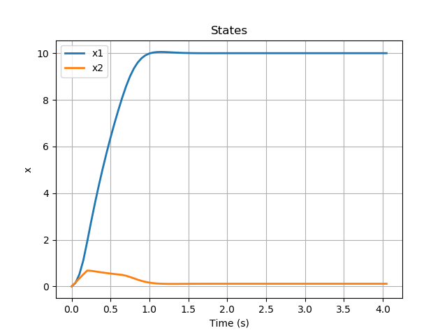
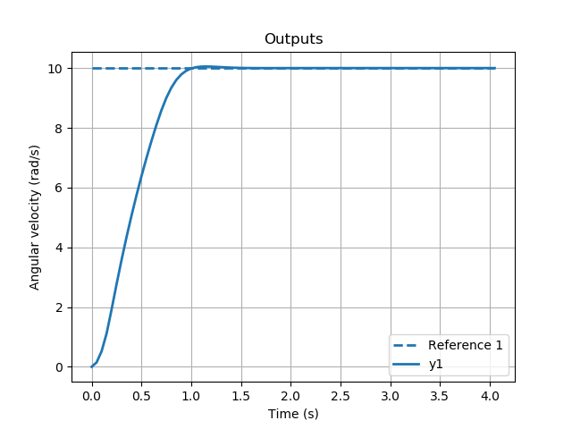

# Predictive Control in Python

This package implements Predictive Control techniques in Python2.7. 
Currently it supports only Model-Predictive Control (MPC), for SISO and MIMO systems, although a class for Economic MPC has been added (not tested!).

## Dependencies

* [numpy](https://www.numpy.org/)
* [scipy](https://www.scipy.org/)
* [cvxopt](https://cvxopt.org/)

## Installation

Install the package directly from PyPI:

```pip install predictivecontrol```

Or clone the repository and install locally:

```pip -e <path_to_repository>```

## Usage

Simply import the class of controller wanted and instantiate it with valid state-space model matrices (i.e., A, B and C).
Optional arguments include sampling time (T), prediction (Np) and control horizons (Nc), actuation limits (umin, umax, dumin, dumax), and whether the provided state-state model should be discretized (discretize).

You may also posteriorly set the prediction and control horizons, the actuation limits, the references and output weights for your control system.

Then use the ```run()``` method to update the controller output based on the last sensed or estimated states.


```
import numpy as np
from predictivecontrol import MPC

# Define your state-space matrices, i.e. A, B, C

# Instantiate controller
mpc = MPC(A,B,C)

# Set prediction and control horizons
mpc.set_predict_horizon(10)
mpc.set_control_horizon(4)

# Set control restrictions (currently variation and amplitude)
mpc.umin, mpc.umax = np.array([0]), np.array([100])     # Considering a SISO system
mpc.dumin, mpc.dumax = np.array([-0.5]), np.array([0.5])

# Set setpoints and output weights
mpc.set_reference(np.array([10]))
mpc.set_output_weights(np.array([1]))

mpc.run()
```

## Examples

This package currently contains 4 [examples](https://github.com/rgmaidana/predictiveControl/tree/master/examples):

* Voltage control in a simulated First-order RC Lowpass filter;
* Motor shaft angular velocity control in a simulated DC Motor;
* Angular velocity control in 3-DoF rotating rigid body (3-input-3-output MIMO);
* Toy mock MIMO systems, modelled from arbitrary transfer matrices;

You can run the examples with:

```python <example>.py```

If you want to plot the results, you must install the matplotlib package:

```pip install matplotlib```

The plotted results you will see are (for DC motor example):





## To-Do

* ~~Test MPC with a different model~~ [DONE]
* ~~Extend MPC to support MIMO systems~~ [DONE]
* ~~Test MPC with MIMO systems~~ [DONE]
* Test E-MPC SISO and MIMO
* Account for external disturbances in MPC SISO and MIMO
* Account for external disturbances in E-MPC SISO and MIMO

## Credits

Code inspired by [Prof. Dr. Aurelio Salton](https://scholar.google.com/citations?user=uyWSHmAAAAAJ&hl=en)'s MPC matlab example.

## Collaborators

* [Renan Maidana](https://github.com/rgmaidana)
